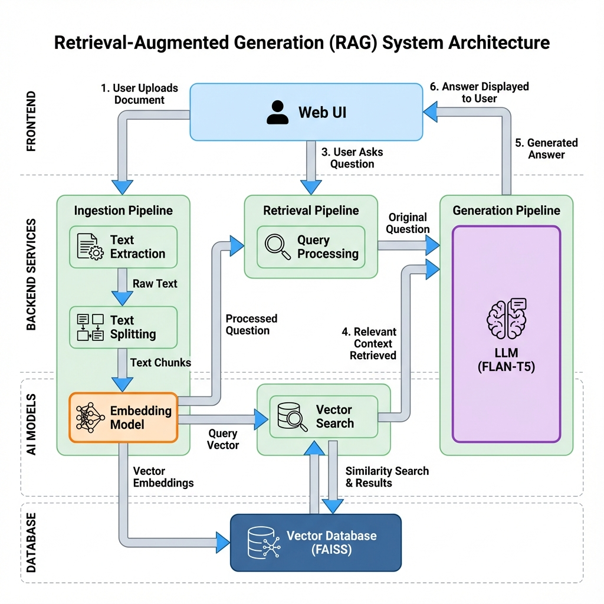

#  Retrieval-Augmented Generation (RAG) Document Q&A Web App

##  Problem Statement
In the era of information overload, manually searching through large documents to find specific information is time-consuming and inefficient. There is a need for an intelligent system that can ingest documents in various formats (PDF, DOCX, TXT) and allow users to query them using natural language. 

This project aims to provide an end-to-end **Retrieval-Augmented Generation (RAG)** web application that solves this problem by combining semantic search with generative AI to deliver accurate, context-aware answers from uploaded documents.

---

##  System Architecture

The system follows a standard RAG pipeline:



1. **Document Ingestion**: User uploads a file (PDF, DOCX, or TXT) via the Web UI.
2. **Text Extraction**: The backend extracts raw text using PyPDF2 or python-docx.
3. **Chunking**: Text is split into smaller, manageable chunks (e.g., 200 characters) to fit model context windows.
4. **Embedding Generation**: Each chunk is converted into a numerical vector using the SentenceTransformer model.
5. **Vector Indexing**: Vectors are stored in a FAISS (Facebook AI Similarity Search) index for efficient similarity search.
6. **Query Processing**: When a user asks a question, it is converted into a vector.
7. **Retrieval**: The system searches the FAISS index for the most relevant text chunks (context) based on the query vector.
8. **Answer Generation**: The retrieved context and the user's question are passed to the Generative LLM (FLAN-T5) to produce a natural language answer.

---

##  Tech Stack

### Frontend
*   **HTML5, CSS3, JavaScript**: For a responsive and modern user interface.

### Backend
*   **Flask (Python)**: Lightweight web framework to handle API requests and serve the app.

### AI & NLP
*   **LangChain**: Framework for building LLM-powered applications.
*   **SentenceTransformers**: For generating dense vector embeddings.
*   **FAISS**: Facebook AI Similarity Search for efficient vector indexing and retrieval.
*   **Hugging Face Transformers**: For the text generation pipeline.
*   **PyTorch**: Deep Learning framework powering the models.

### Document Parsing
*   **PyPDF2**: For extracting text from PDF files.
*   **python-docx**: For extracting text from DOCX files.

---

##  Models Used

### Embedding Model
*   **Model**: `all-MiniLM-L6-v2`
*   **Role**: Converts text into 384-dimensional vectors. Optimized for speed and performance.

### Generative Model
*   **Model**: `google/flan-t5-base`
*   **Role**: Sequence-to-sequence model capable of following instructions and generating coherent answers from context.

---

##  Result & Features

The project successfully delivers a responsive, local-first web application. Users can upload documents and receive accurate, context-based answers in real-time without needing external API keys or heavy GPU resources.

*    **Seamless Document Upload**: Support for PDF, DOCX, and TXT files.
*    **Efficient Indexing**: Fast retrieval using FAISS.
*    **Contextual Q&A**: Accurate answers generated by FLAN-T5.
*    **No GPU Required**: Optimized to run efficiently on CPU.
*    **UI**: Clean, responsive interface.

---

## Future Improvements

*   **Improved Accuracy**: Implementing advanced retrieval techniques like Hybrid Search (Keyword + Vector) and re-ranking retrieved results.
*   **Advanced Models**: Integration with larger, more powerful models such as Llama-3, Mistral-7B, or GPT-4 (via API).
*   **Persistent Storage**: Saving the FAISS index to disk so users don’t have to re-upload documents on server restart.
*   **Multi-Document Support**: Allowing users to query across multiple uploaded documents simultaneously.
*   **UI/UX Enhancements**: Adding chat history, citation highlighting, and dark mode.

---

##  Project Structure

```
rag_app/
│
├── app.py                 # Flask entry point
├── requirements.txt       # Dependencies
│
├── backend/
│   ├── __init__.py
│   └── rag_engine.py      # Core RAG logic (FAISS + Hugging Face)
│
├── uploads/               # Stores user-uploaded files
│
├── templates/
│   └── index.html         # Frontend HTML UI
│
└── static/
    └── style.css          # Custom styles
```

---

##  Setup Instructions

### 1 Clone the Repository
```bash
git clone https://github.com/<your-username>/rag-document-qa.git
cd rag-document-qa
```

### 2️ Create Virtual Environment
```bash
python -m venv venv
venv\Scripts\activate   # Windows
# OR
source venv/bin/activate   # macOS/Linux
```

### 3️ Install Requirements
```bash
pip install -r requirements.txt
```

### 4️ Run the App
```bash
python app.py
```

---

## License
This project is licensed under the MIT License — free to use, modify, and distribute.
